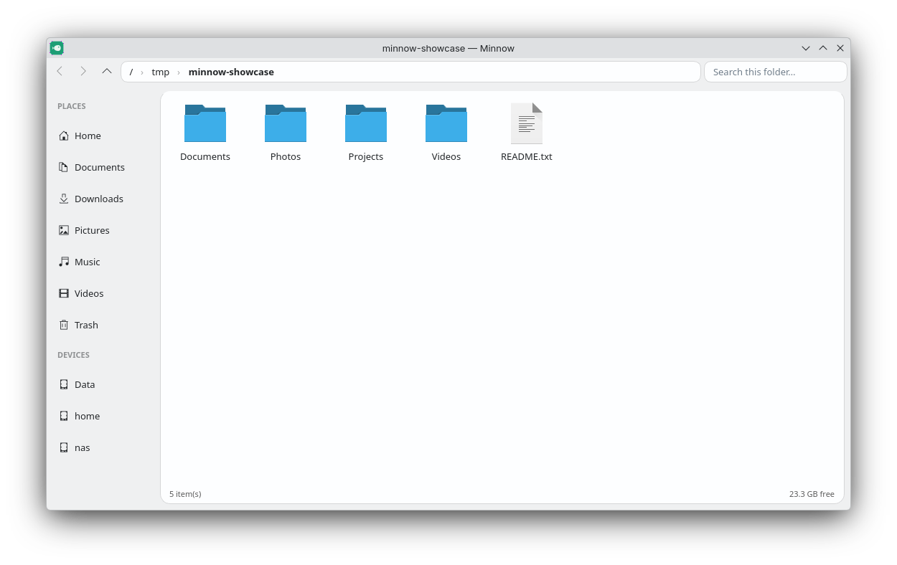
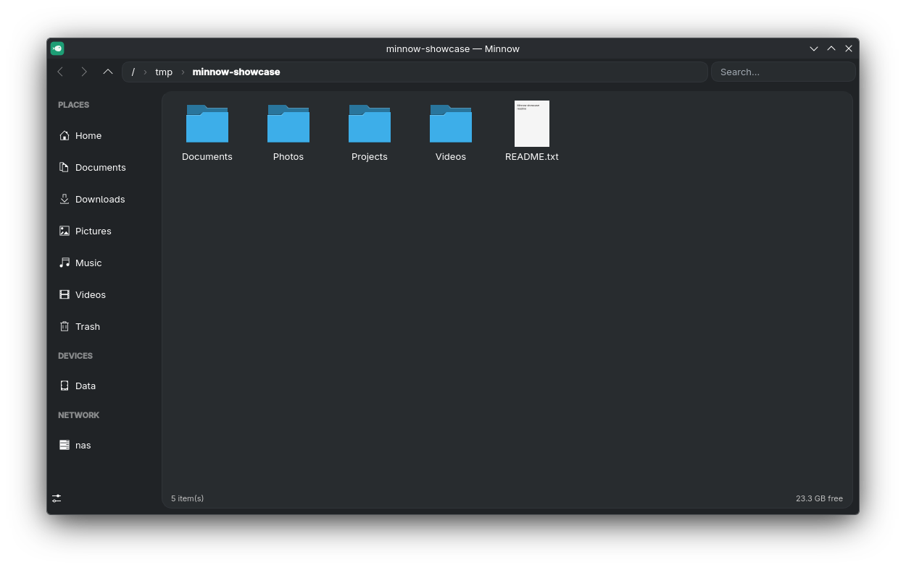

# Minnow

A simple, lightweight file manager for KDE - built from scratch against Qt6 and KDE Frameworks (KIO), as a smaller alternative to Dolphin.

| Light | Dark |
| --- | --- |
|  |  |

## Features

- Grid (icon) and list (details) views, switchable per folder - each folder remembers its own view mode
- Per-folder sorting (column + order), independent of other folders
- Places sidebar: Home, Documents, Downloads, Pictures, Music, Videos, Trash - each can be shown or hidden
- Pin any folder to the sidebar, optionally into your own custom sections (create/delete sections from the sidebar's right-click menu)
- Mounted drives shown automatically below your pins
- Address bar navigation, back/forward/up history, name filtering
- Adjustable icon size (Small/Medium/Large/Huge), defaulting to large icons
- File operations via KIO: copy, cut/paste, rename, new folder, move to trash, permanent delete
- Undo/redo (`Ctrl+Z` / `Ctrl+Shift+Z`) for copy, move, trash, mkdir, and rename - permanent delete is intentionally not undoable
- `Delete` to trash the current selection, `Shift+Delete` to delete it permanently
- Open a specific directory from the command line: `minnow /some/path`

## Dependencies

- Qt6 (Widgets)
- KDE Frameworks 6: CoreAddons, ConfigWidgets, WidgetsAddons, KIO
- CMake ≥ 3.16, a C++17 compiler

## Building

```sh
cmake -S . -B build -DCMAKE_BUILD_TYPE=Release
cmake --build build -j"$(nproc)"
```

## Running

```sh
./build/minnow              # opens your home directory
./build/minnow /some/path   # opens a specific directory (or a file's parent directory)
```

## Installing

```sh
cmake --install build --prefix /usr/local
```

This installs the `minnow` binary, a `.desktop` file, an icon, and an AppStream metainfo file to the standard FHS locations (`bin`, `share/applications`, `share/icons/hicolor/scalable/apps`, `share/metainfo`).

## Packaging

Packaging manifests/scripts live under `packaging/`, one subdirectory per format. All of them
currently point at the `v0.1.0` tag as a placeholder — replace it once a real release tag exists.

### Automated builds

Pushing a tag matching `v*.*.*` triggers [`.github/workflows/release.yml`](.github/workflows/release.yml),
which builds a `.deb`, an `.rpm`, a Snap, a Flatpak bundle, an Arch Linux binary tarball, and a
source tarball, then attaches all of them to that tag's GitHub Release. It can also be run
manually against an existing tag from the Actions tab (`workflow_dispatch`).

- Snap Store publishing only runs if a `SNAPCRAFT_STORE_CREDENTIALS` repo secret is set
  (from `snapcraft export-login`); otherwise that step is skipped and only the built `.snap`
  is attached to the release.
- Flathub publishing isn't automated here — see below.
- This workflow hasn't been exercised against a real tag yet, since no tag exists — treat the
  first real release as the actual test of the pipeline.

### AUR

Two packages, under `packaging/aur/`:

- **`minnow`** (`packaging/aur/minnow/`) — builds from the tagged source tarball.
- **`minnow-bin`** (`packaging/aur/minnow-bin/`) — installs the prebuilt Arch binary tarball
  that the release workflow attaches to each GitHub Release (built in an `archlinux:latest`
  container, so it's ABI-compatible with a current Arch install).

Both have a placeholder `sha256sums=('SKIP')` — run `updpkgsums` in each directory once a real
tag exists, then push each directory's contents to its own AUR git repo
(`ssh://aur@aur.archlinux.org/minnow.git` and `.../minnow-bin.git`) - the AUR itself is not
this repository.

### Flatpak

`packaging/flatpak/net.minnow.Minnow.yaml` builds against `org.kde.Platform`. Build locally with
`flatpak-builder`:
```sh
flatpak-builder --user --install build-dir packaging/flatpak/net.minnow.Minnow.yaml
```
To publish on Flathub, submit this manifest (with a real tag) as a PR to
[flathub/flathub](https://github.com/flathub/flathub) following their submission process —
this is Flathub's own review process, not something that can be automated from this repo.

### Snap

`packaging/snap/snapcraft.yaml` uses the `kde-neon` extension. Build with:
```sh
cd packaging/snap && snapcraft
```
Note strict confinement means Minnow only gets access to the home directory and removable
media by default, not the whole filesystem.

### .deb / .rpm

Run `packaging/deb/build.sh` (needs `dpkg-dev`, `debhelper`) or `packaging/rpm/build.sh`
(needs `rpm-build`) directly - output goes to `dist/`. The release workflow runs both of
these too.

### apps.kde.org

There's no separate manual submission step for apps.kde.org — its catalog is generated from
AppStream metadata (`data/net.minnow.Minnow.metainfo.xml`) for apps that are discoverable
through Flathub or distro repos. Getting Minnow onto Flathub (see above) with valid metainfo
is what makes it eligible to be picked up there.

## Testing

Automated tests cover the pure path-computation logic (folder navigation, rename/mkdir destination paths) via QTest:

```sh
ctest --test-dir build --output-on-failure
```

## Project layout

```
src/                  Application source
  main.cpp            Entry point, CLI argument parsing
  MainWindow.*         Toolbar, views, navigation, file operations, context menus
  PlacesSidebar.*      Sidebar: places, pinned sections, drives
  FileOperations.*     KIO job wrappers (copy/move/trash/rename/mkdir), undo recording
  PathUtils.*          Pure URL/path helpers, shared and unit-tested
tests/                 QTest unit tests
data/                  .desktop file, icon, AppStream metainfo
packaging/             Flatpak manifest, Snap manifest, .deb/.rpm build scripts
```

## Known limitations

- No thumbnailing or service menus yet
- No multi-window support
- Window corners aren't rounded - Qt can't round a native top-level window without going frameless, which would drop KDE's native titlebar and controls
